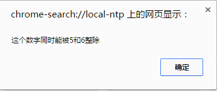
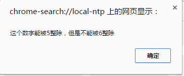
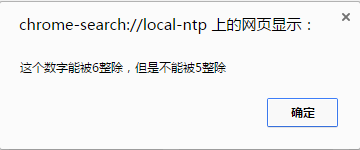
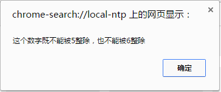
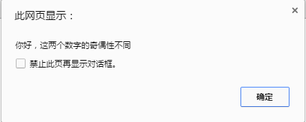

1. 请写出两种将Javascript应用到网页的方式 
答：
方法一：写在html中的script标签中。
```
<head>
    <script>
        (js代码)
    </script>
</head>
```
方法二：写在外部js文件中，在页面引入。
```
<script src="(js文件地址)"></script>
```
 
2. 如何定义一个变量？变量的命名规则有哪些？
 答：定义方法：使用一个var的关键字进行定义，后面必须加一个空格，空格后面自定义变量名。
 命名规则：由字母、数字、下划线、$符号组成，不能以数字开头。字母区分大小写，不能是js系统的关键字和保留字。
3.  == 和 === 的区别
答：== 是相等，只判断值大小是否相等，不判断数据类型。
=== 是全等，不止判断值大小相等，还要判断数据类型相等。
 
4. JS的简单数据类型有哪些并简单描述
答：简单数据类型有以下：
- Number 数字类型，不区分整数、浮点数、特殊值。
- String 字符串类型，可以是引号内的任意文本。
- Boolean 布尔类型，只有true和false两个值，必须是小写字母。
- Undefined 未定义类型，表示变量不含有值。本身是一个数据。
- Null 对空，表示一个空对象指针，本身是一个数据。
 
5. JS的算数运算符有哪些
答：算术运算符：加+、减-、乘*、除/、取余%、括号()
 
6. JS的比较运算符有哪些
答：比较运算符：大于>、小于<、大于等于>=、小于等于<=、相等==、不等!=、全等===、不全等!==。
 
7. JS的逻辑运算符有哪些
答：逻辑运算符：且&&、或||、非!。
 
8. var i = 100; i++; j = i++;y = ++j;请问j和y分别是多少
答：j = 102;y = 102
 
9. 计算下列算式，并将结果输出：
 
                                
10. 住房公积金缴纳金额与工资两者的关系是：
 
住房公积金 = 税前工资 * 0.1 * 2 ;
 
编写程序，让用户输入税前工资，弹出对应的公积金数额。
 
11.   用JS计算下列算式，并将结果在弹出：

 
12.   编写程序，提示用户输入圆锥的底面半径和高，然后弹出它的体积，计算圆锥体积的公式是：
体积V=1/3π半径2*高
 
13.   如果今天是星期二，那么1000天后是星期几？用户输入一个天数，计算这个天数后是星期几。
14.   用户输入一个三位数，弹出各个数位的和。
比如：
用户输入155，就弹出11
用户输入316，就弹出10
用户输入989，就弹出26
用户输入678，就弹出21
15.   用户输入一个数字，然后判断这个数字能否被5、6整除的情况，根据情况弹出下面4种警告框：
 比如30

 比如15
 
 比如18
 
 比如14

 
16.   用户输入一个数字，然后再输入一个数字。然后弹出警告框：

比如用户输入3、147，都是奇数

 比如用户输入6、171，不一样
注意，我们并不关心他们“都为奇数”、“都为偶数”，只是关心奇偶性一致的情况
 
17.  用户输入一个年份，判断这个年是否是闰年。
判断闰年条件：
① 非整百年数除以4，无余为闰，有余不闰；
② 整百年数除以400，无余为闰，有余不闰。
比如：
2000年，整百数年，就要用②公式，除以400，无余数，所以是闰年。
1900年，整百年数，就要用②公式，除以400，有余数，所以不是闰年。
 
2100不是
……
2016
2012
2008
2004
2000
……
……
1904
1900不是
 
自己把中文判断条件转为计算机语言。

18.   推导循环执行的顺序，用文字进行说明，并推导出可能的结果。
  for(var m = 1,n = 2; m + n < 25; m++){
       n += 3;
       console.log(m);
  }
 答：for循环，先执行定义变量m=1，n=2；执行完毕后立即执行m+n<25，如果m+n不小于25，条件为假，则跳出循环，不再往下执行。如果m+n小于25，进入循环体执行n += 3，console.log(m);再执行m++，执行完毕再执行m+n < 25,判断真假，进入下一次循环，直到 m+n<25为假，循环结束。
 控制台输出结果有：1，2，3，4，5，6

19.   推导循环执行的顺序，用文字进行说明，并推导出可能的结果。
             for(var i = 30 ; i > 5 ; i -= 7){
                     console.log(i--);
              }
  答：for循环，先执行定义变量i=30；执行完毕后立即执行i>5，如果i不大于5，条件为假，则跳出循环，不再往下执行。如果i大于5，进入循环体执行console.log(i--);再执行i -= 7，执行完毕再执行i > 5,判断真假，进入下一次循环，直到 i > 5为假，循环结束。
控制台输出结果有：30，22，14，6
20.   用户输入一个数字n，计算1+2+3+4+……n的和。
 
21.   用户输入一个整数n，计算n的阶乘。即n*(n-1)*(n-2)*……*3*2*1.
 
22.   用户输入一个数字n计算
   

23.   用户输入一个数字，在控制台中列出它的所有约数。
 
24.   水仙花数是一种特殊的四位数，它的特点就是，每个数位的四次方和，等于它本身。
 请编程找出来。
 
25.   如果一个数恰好等于它的约数之和，则称该数为“完美数”。
例如：
第1个完全数是6，它有约数1、2、3、6，除去它本身6外，其余3个数相加，1+2+3=6。第2个完全数是28，它有约数1、2、4、7、14、28，除去它本身28外，其余5个数相加，1+2+4+7+14=28。
试寻找1~10000之间的所有完美数。
 
26.   用户输入一个数字，判断这个数字是否是质数。
质数就是指它的约数只有1和它本身。看约数个数是否是2.
 
27.   列出1~10000的所有质数。
 
28.   苹果3元一个，鸭梨2元一个，桃子1元一个。现在想用200元正好买100个水果，在控制台中列出所有可能性。
 
 
29.   有这样一个代码
29.switch(name) {
29.     case "jt":
29.    alert('金团网);
29.    break;
29.    case "ejt":
29.              alert('金团相相贷');
29.    break;
29.    case "ejin":
29.             alert("网上综合金融体验馆");
29.             break;
29.    default:
29.             alert("金团网络典当");
29.}
29.请用if来实现上面的效果
答：
```
if (name === "jt") {
    alert("金团网");
}else if (name === "ejt") {
    alert("金团相相贷");
}else if (name === "ejin") {
    alert("网上综合金融体验馆");
}else {
    alert("金团网络典当");
}
```
 
30.   JS有几种循环，分别是什么
答：JS有三种循环，分别是for循环、do while 循环、while循环。
 
31.   break和continue的区别是什么
答：break语句的作用可以立即停止当前的for、do while、while循环。让循环不再往下继续。
continue语句是用来跳过当前次的循环，立即进入下一次循环。
 
32.   请用循环计算出 1+2+3+4+5+...+100   的值

 
33.   开发一款软件，根据公式（身高-108）*2=体重，可以有10斤左右的浮动。判断测试者体重为标准体重还是超重还是偏瘦
 
34.   var grade = prompt("请输入分数");
        switch (parseInt(grade / 10)) {
             case 10:
             case 9:
                 alert("你的成绩等级为优秀");
                 break;
             case 8:
             case 7:
             case 6:
                 alert("你的成绩等级为良好");
                 break;
             default:
                 alert("你的成绩等级为不及格，继续加油哦！");
         }
      将上述代码使用switch写法的另一种方式实现，以及使用if判断实现一次
 
35.   输入月份，显示当月天数（输入2月时需要再次输入年份判断是不是闰年后在显示当月天数）


 * @FilePath: /homework_five/1.md
-->
